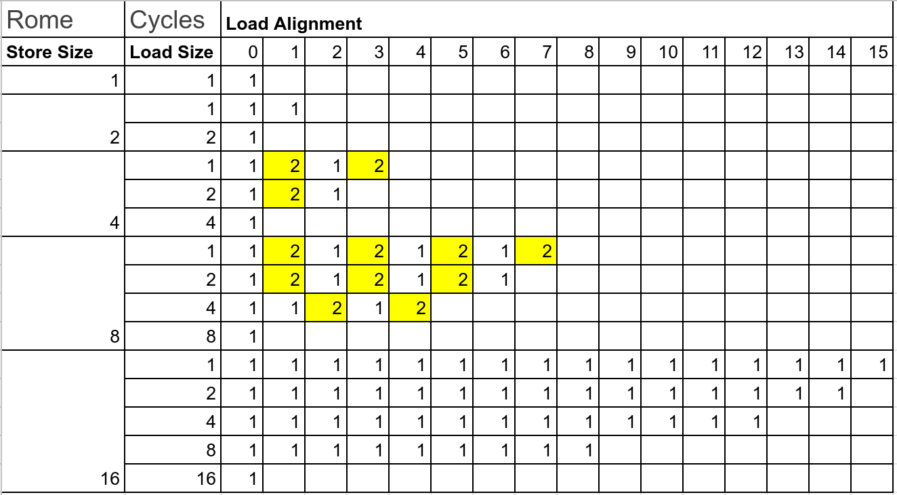
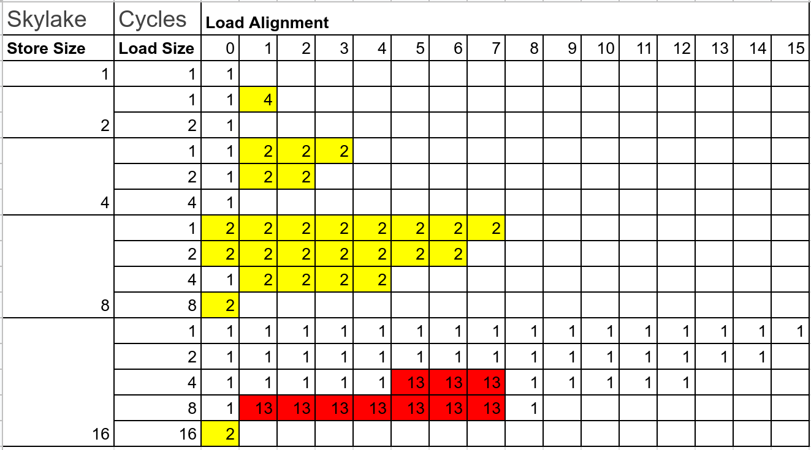
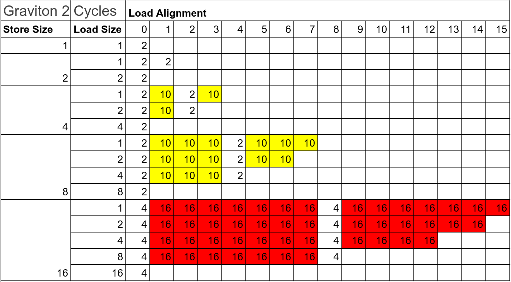

# Forward store benchmark

This repo exercises forward store benchmarking. Modern processors can forward a memory store to a subsequent load from the same address. This is called “store-to-load forwarding”, and it improves performance because the load does not have to wait for the data to be written to the cache and then read back again. For reference, see [Agner Fog's guide](https://www.agner.org/optimize/microarchitecture.pdf).

The example of a forward store is:

```asm
movaps  xmmword ptr [rsp], xmm0
mov     eax, dword ptr [rsp + 2]
```

It loads 16 bytes and reads 4 bytes with the offset 2.

Benchmarks are represented in a `store_X_load_Y_offset_Z` where we store X bytes, load Y bytes with the offset Z. Latency tables for some random Intel, AMD and Arm processors.







In the end it means you should avoid in libraries loading last bytes or loading bytes across the boundary of 8 bytes -- it has bad performance on Intel and Arm. AMD has been quite good overall.

TBD: more processors.
